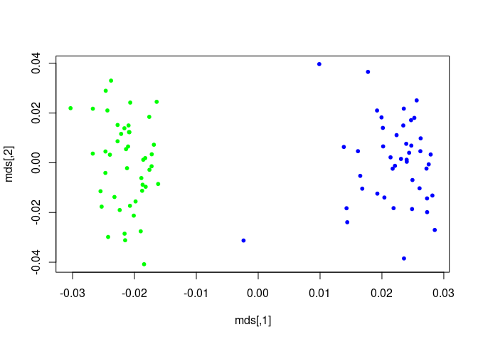

PLINK Tutorial (Purcell et al. [2007](#ref-Purcell))
====================================================

Analyze random genotypes from HapMaps using PLINK (Purcell et al. [2007](#ref-Purcell))
---------------------------------------------------------------------------------------

Check file is intact
--------------------

    plink --file hapmap1

Make binary PED file
--------------------

    plink --file hapmap1 --make-bed --out hapmap1

add –mind 0.05 as an option to only include subjects with 95% genotyping
------------------------------------------------------------------------

    plink --file hapmap1 --make-bed --mind 0.05 --out highgeno

add -bfile so that it knows input is binary and not PED or MAP format
---------------------------------------------------------------------

    plink --bfile hapmap1

run stats on the rate of missing data
-------------------------------------

    plink --bfile hapmap1 --missing --out miss_stat

stats on per indivual missing data
----------------------------------

    ##  CHR         SNP   N_MISS   N_GENO   F_MISS
    ##    1   rs6681049        0       89        0
    ##    1   rs4074137        0       89        0
    ##    1   rs7540009        0       89        0
    ##    1   rs1891905        0       89        0
    ##    1   rs9729550        0       89        0
    ##    1   rs3813196        0       89        0
    ##    1   rs6704013        2       89  0.02247
    ##    1    rs307347       12       89   0.1348
    ##    1   rs9439440        2       89  0.02247

stats on per SNP missing data
-----------------------------

    ##      FID  IID MISS_PHENO   N_MISS   N_GENO   F_MISS
    ##   HCB181    1          N      671    83534 0.008033
    ##   HCB182    1          N     1156    83534  0.01384
    ##   HCB183    1          N      498    83534 0.005962
    ##   HCB184    1          N      412    83534 0.004932
    ##   HCB185    1          N      329    83534 0.003939
    ##   HCB186    1          N     1233    83534  0.01476
    ##   HCB187    1          N      258    83534 0.003089
    ##   HCB188    1          N      864    83534  0.01034
    ##   HCB189    1          N      517    83534 0.006189

analzye data by chromosome (1 and 2)
------------------------------------

    plink --bfile hapmap1 --chr 1 --out res1 --missing
    plink --bfile hapmap1 --chr 2 --out res2 --missing

analysis on allele frequency within the population
--------------------------------------------------

    plink --bfile hapmap1 --freq --out freq_stat
    plink --bfile hapmap1 --freq --within pop.phe --out freq_stat

    ##  CHR         SNP     CLST   A1   A2      MAF    MAC  NCHROBS
    ##    1   rs6681049        1    1    2   0.2333     21       90 
    ##    1   rs6681049        2    1    2   0.1932     17       88 
    ##    1   rs4074137        1    1    2      0.1      9       90 
    ##    1   rs4074137        2    1    2  0.05682      5       88 
    ##    1   rs7540009        1    0    2        0      0       90 
    ##    1   rs7540009        2    0    2        0      0       88 
    ##    1   rs1891905        1    1    2   0.4111     37       90 
    ##    1   rs1891905        2    1    2   0.3977     35       88 
    ##    1   rs9729550        1    1    2   0.1444     13       90

look within a particular SNP in the two populations
---------------------------------------------------

    plink --bfile hapmap1 --snp rs1891905 --freq --within pop.phe --out snp1_frq_stat

Association analysis on the trait for each SNP and sort
-------------------------------------------------------

    plink --bfile hapmap1 --assoc --out as1

    ##  CHR         SNP         BP   A1      F_A      F_U   A2        CHISQ            P           OR 
    ##    1   rs6681049          1    1   0.1591   0.2667    2        3.067      0.07991       0.5203 
    ##    1   rs4074137          2    1  0.07955  0.07778    2     0.001919       0.9651        1.025 
    ##    1   rs7540009          3    0        0        0    2           NA           NA           NA 
    ##    1   rs1891905          4    1   0.4091      0.4    2      0.01527       0.9017        1.038 
    ##    1   rs9729550          5    1   0.1705  0.08889    2        2.631       0.1048        2.106 
    ##    1   rs3813196          6    1  0.03409  0.02222    2       0.2296       0.6318        1.553 
    ##    1   rs6704013          7    0        0        0    2           NA           NA           NA 
    ##    1    rs307347          8    0        0        0    2           NA           NA           NA 
    ##    1   rs9439440          9    0        0        0    2           NA           NA           NA

    ##    9    rs999510      47206    1   0.4091   0.3864    2      0.09488       0.7581          1.1 
    ##    9    rs999484      49016    1  0.02273  0.02222    2    0.0005167       0.9819        1.023 
    ##    9    rs999398      46425    1   0.1591   0.1889    2       0.2747       0.6002       0.8124 
    ##    9    rs998226      47266    1    0.375   0.4778    2        1.921       0.1657       0.6558 
    ##    9    rs997540      49756    1   0.3977   0.4333    2       0.2322       0.6299       0.8636 
    ##    9   rs9969732      48079    0        0        0    2           NA           NA           NA 
    ##    9   rs9969724      46038    0        0        0    2           NA           NA           NA 
    ##    9   rs9969710      47755    1   0.1023   0.1556    2        1.123       0.2893       0.6184 
    ##    9    rs995923      47709    1   0.2045   0.2444    2       0.4066       0.5237       0.7948 
    ##    9    rs995903      47398    1  0.04545      0.1    2        1.955        0.162       0.4286

Include the significance using –adjust
--------------------------------------

    plink --bfile hapmap1 --assoc --adjust --out as2

    ##  CHR         SNP      UNADJ         GC       BONF       HOLM   SIDAK_SS   SIDAK_SD     FDR_BH     FDR_BY
    ##   13   rs9585021  5.586e-06  4.994e-05     0.3839     0.3839     0.3188     0.3188    0.09719          1 
    ##    2   rs2222162  5.918e-06  5.232e-05     0.4068     0.4067     0.3342     0.3342    0.09719          1 
    ##    9  rs10810856  7.723e-06  6.483e-05     0.5308     0.5308     0.4118     0.4118    0.09719          1 
    ##    2   rs4675607   8.05e-06  6.703e-05     0.5533     0.5533     0.4249     0.4249    0.09719          1 
    ##    2   rs4673349  8.485e-06  6.994e-05     0.5832     0.5831     0.4419     0.4419    0.09719          1 
    ##    2   rs1375352  8.485e-06  6.994e-05     0.5832     0.5831     0.4419     0.4419    0.09719          1 
    ##   21    rs219746  1.228e-05  9.422e-05     0.8442     0.8441     0.5701     0.5701     0.1206          1 
    ##    1   rs4078404  2.667e-05   0.000176          1          1     0.8401       0.84     0.2291          1 
    ##   14   rs1152431  3.862e-05  0.0002374          1          1     0.9297     0.9297     0.2737          1

look at inflation factor by repalcing disease phenotype with one from the populaiton
------------------------------------------------------------------------------------

    ## PLINK v1.90b4.9 64-bit (13 Oct 2017)           www.cog-genomics.org/plink/1.9/
    ## (C) 2005-2017 Shaun Purcell, Christopher Chang   GNU General Public License v3
    ## Logging to as3.log.
    ## Options in effect:
    ##   --adjust
    ##   --assoc
    ##   --bfile hapmap1
    ##   --out as3
    ##   --pheno pop.phe
    ## 
    ## 193230 MB RAM detected; reserving 96615 MB for main workspace.
    ## 83534 variants loaded from .bim file.
    ## 89 people (89 males, 0 females) loaded from .fam.
    ## 89 phenotype values present after --pheno.
    ## Using 1 thread (no multithreaded calculations invoked).
    ## Before main variant filters, 89 founders and 0 nonfounders present.
    ## Calculating allele frequencies... 0%1%2%3%4%5%6%7%8%9%10%11%12%13%14%15%16%17%18%19%20%21%22%23%24%25%26%27%28%29%30%31%32%33%34%35%36%37%38%39%40%41%42%43%44%45%46%47%48%49%50%51%52%53%54%55%56%57%58%59%60%61%62%63%64%65%66%67%68%69%70%71%72%73%74%75%76%77%78%79%80%81%82%83%84%85%86%87%88%89%90%91%92%93%94%95%96%97%98%99% done.
    ## Total genotyping rate is 0.99441.
    ## 83534 variants and 89 people pass filters and QC.
    ## Among remaining phenotypes, 44 are cases and 45 are controls.
    ## Writing C/C --assoc report to as3.assoc ... 0%1%2%3%4%6%7%8%9%10%11%12%14%15%16%17%18%19%20%22%23%25%26%27%28%29%31%32%33%34%35%36%38%39%40%41%42%43%45%46%47%48%49%50%51%53%54%55%56%58%59%60%61%62%63%65%66%67%68%69%70%72%73%74%76%77%78%79%80%81%83%84%85%87%88%89%90%92%93%94%95%96%97%98%99%done.
    ## --adjust: Genomic inflation est. lambda (based on median chisq) = 1.78854.
    ## 0%1%2%3%4%5%6%7%8%9%10%11%12%13%14%15%16%17%18%19%20%21%22%23%24%25%26%27%28%29%30%31%32%33%34%35%36%37%38%39%40%41%42%43%44%45%46%47%48%49%50%51%52%53%54%55%56%57%58%59%60%61%62%63%64%65%66%67%68%69%70%71%72%73%74%75%76%77%78%79%80%81%82%83%84%85%86%87%88%89%90%91%92%93%94%95%96%97%98%99%--adjust values (68727 variants) written to as3.assoc.adjusted .

calculate stats based on 2x3 table and alleic test followed by Cochran-Armitage trend using –model. Change the cell option to 0
-------------------------------------------------------------------------------------------------------------------------------

    plink --bfile hapmap1 --model --snp rs2222162 --out mod1
    plink --bfile hapmap1 --model --cell 0 --snp rs2222162 --out mod2

    ##  CHR         SNP   A1   A2     TEST            AFF          UNAFF        CHISQ   DF            P
    ##    2   rs2222162    1    2     GENO        3/19/22        17/22/6           NA   NA           NA
    ##    2   rs2222162    1    2    TREND          25/63          56/34        19.15    1    1.207e-05
    ##    2   rs2222162    1    2  ALLELIC          25/63          56/34        20.51    1    5.918e-06
    ##    2   rs2222162    1    2      DOM          22/22           39/6           NA   NA           NA
    ##    2   rs2222162    1    2      REC           3/41          17/28           NA   NA           NA

    ##  CHR         SNP   A1   A2     TEST            AFF          UNAFF        CHISQ   DF            P
    ##    2   rs2222162    1    2     GENO        3/19/22        17/22/6        19.15    2    6.932e-05
    ##    2   rs2222162    1    2    TREND          25/63          56/34        19.15    1    1.207e-05
    ##    2   rs2222162    1    2  ALLELIC          25/63          56/34        20.51    1    5.918e-06
    ##    2   rs2222162    1    2      DOM          22/22           39/6        13.87    1    0.0001958
    ##    2   rs2222162    1    2      REC           3/41          17/28        12.24    1    0.0004679

Cluster the individuals based on whole genome data into homogeneous groups, genetic idenity of p =0.05 in clusters of 2
-----------------------------------------------------------------------------------------------------------------------

    plink --bfile hapmap1 --cluster --mc 2 --ppc 0.05 --out str1

    ## SOL-0     HCB181_1 JPT260_1
    ## SOL-1     HCB182_1 HCB225_1
    ## SOL-2     HCB183_1 HCB194_1
    ## SOL-3     HCB184_1 HCB202_1
    ## SOL-4     HCB185_1 HCB217_1
    ## SOL-5     HCB186_1 HCB201_1
    ## SOL-6     HCB187_1 HCB189_1
    ## SOL-7     HCB188_1 HCB206_1
    ## SOL-8     HCB190_1 HCB224_1
    ## SOL-9     HCB191_1 HCB220_1

use CMH association stats to look at SNP association based on clustering
------------------------------------------------------------------------

    plink --bfile hapmap1 --mh --within str1.cluster2 --adjust --out aac1

    ##  CHR         SNP      UNADJ         GC       BONF       HOLM   SIDAK_SS   SIDAK_SD     FDR_BH     FDR_BY
    ##   13   rs9585021  1.906e-06  4.418e-06     0.1274     0.1274     0.1196     0.1196     0.1274          1 
    ##   21   rs3017432  2.209e-05  4.332e-05          1          1     0.7716     0.7716     0.7384          1 
    ##    2   rs2222162  4.468e-05  8.353e-05          1          1     0.9496     0.9495     0.8734          1 
    ##   17   rs3829612  7.177e-05  0.0001299          1          1     0.9918     0.9918     0.8734          1 
    ##    2   rs4673349  9.617e-05  0.0001707          1          1     0.9984     0.9984     0.8734          1 
    ##    2   rs1375352  9.617e-05  0.0001707          1          1     0.9984     0.9984     0.8734          1 
    ##   15   rs4887466  0.0001215  0.0002123          1          1     0.9997     0.9997     0.8734          1 
    ##   12  rs12823722    0.00026  0.0004317          1          1          1          1     0.8734          1 
    ##    9   rs2025330    0.00026  0.0004317          1          1          1          1     0.8734          1

Use clustering of one disease and one control p=0.01
----------------------------------------------------

    plink --bfile hapmap1 --cluster --cc --ppc 0.01 --out version2

repeat association analysis with new clustering
-----------------------------------------------

    plink --bfile hapmap1 --mh --within version2.cluster2 --adjust --out aac2

    ##  CHR         SNP         BP   A1      MAF   A2      CHISQ          P         OR         SE        L95        U95 
    ##    1   rs6681049          1    1   0.2135    2      3.172     0.0749     0.4721     0.4265     0.2047      1.089 
    ##    1   rs4074137          2    1  0.07865    2     0.3676     0.5443       1.53     0.6607     0.4191      5.587 
    ##    1   rs7540009          3    0        0    2         NA         NA         NA         NA         NA         NA 
    ##    1   rs1891905          4    1   0.4045    2    0.01165     0.9141      1.038     0.3412     0.5318      2.026 
    ##    1   rs9729550          5    1   0.1292    2      3.782    0.05181      2.794     0.5286     0.9916      7.875 
    ##    1   rs3813196          6    1  0.02809    2     0.1865     0.6658      1.833      1.217     0.1688       19.9 
    ##    1   rs6704013          7    0        0    2         NA         NA         NA         NA         NA         NA 
    ##    1    rs307347          8    0        0    2         NA         NA         NA         NA         NA         NA 
    ##    1   rs9439440          9    0        0    2         NA         NA         NA         NA         NA         NA

    ## SOL-0     HCB181_1(1) HCB182_1(1) HCB186_1(1) HCB201_1(2) HCB217_1(1) HCB205_1(1) HCB194_1(1) HCB199_1(1) HCB221_1(2) HCB225_1(1) HCB197_1(1) HCB214_1(2) HCB212_1(1) JPT227_1(2) JPT229_1(2) JPT243_1(1) JPT266_1(2) JPT240_1(2) JPT246_1(2) JPT230_1(2) JPT262_1(1) JPT267_1(2) JPT245_1(2) JPT254_1(1) JPT264_1(2)
    ## SOL-1     HCB183_1(2) HCB206_1(1) HCB208_1(1) HCB189_1(1) HCB191_1(2) HCB220_1(1) HCB196_1(1) HCB207_1(2) HCB223_1(1) JPT253_1(1) HCB203_1(1) HCB193_1(1) HCB195_1(1) HCB215_1(2) HCB216_1(1)
    ## SOL-2     HCB184_1(1) HCB219_1(2) HCB218_1(1) HCB200_1(1) HCB190_1(1) HCB202_1(1) HCB224_1(2) HCB185_1(1) HCB198_1(1) HCB210_1(2) HCB222_1(1) HCB188_1(1) HCB192_1(1) HCB187_1(1) HCB209_1(1) HCB211_1(2) HCB213_1(1)
    ## SOL-3     HCB204_1(1) JPT255_1(2) JPT235_1(2) JPT237_1(2) JPT250_1(1) JPT251_1(2) JPT258_1(2) JPT228_1(1) JPT252_1(2) JPT242_1(2) JPT232_1(2) JPT249_1(2) JPT236_1(2) JPT256_1(1) JPT261_1(2) JPT247_1(2) JPT268_1(2) JPT259_1(2) JPT260_1(2) JPT257_1(2)
    ## SOL-4     JPT226_1(1) JPT244_1(2) JPT238_1(2) JPT233_1(1) JPT248_1(2) JPT241_1(2) JPT234_1(2) JPT265_1(1) JPT269_1(2) JPT231_1(1) JPT239_1(2) JPT263_1(2)

K option to make two clusters and remove significance
-----------------------------------------------------

    plink --bfile hapmap1 --cluster --K 2 --out version3

    ## SOL-0     HCB181_1 HCB183_1 HCB195_1 HCB193_1 HCB187_1 HCB209_1 HCB211_1 HCB205_1 HCB208_1 HCB189_1 HCB191_1 HCB220_1 HCB197_1 HCB214_1 HCB212_1 HCB199_1 HCB221_1 HCB207_1 HCB223_1 HCB182_1 HCB225_1 HCB190_1 HCB185_1 HCB217_1 HCB198_1 HCB210_1 HCB222_1 HCB192_1 HCB184_1 HCB219_1 HCB218_1 HCB224_1
    ## SOL-1     HCB186_1 HCB201_1 HCB213_1 HCB188_1 HCB206_1 HCB194_1 HCB200_1 HCB215_1 HCB216_1 HCB196_1 JPT253_1 HCB202_1 HCB203_1 HCB204_1 JPT255_1 JPT226_1 JPT244_1 JPT238_1 JPT269_1 JPT233_1 JPT248_1 JPT232_1 JPT247_1 JPT235_1 JPT237_1 JPT250_1 JPT246_1 JPT249_1 JPT258_1 JPT227_1 JPT266_1 JPT268_1 JPT229_1 JPT243_1 JPT251_1 JPT259_1 JPT267_1 JPT228_1 JPT252_1 JPT242_1 JPT234_1 JPT245_1 JPT254_1 JPT264_1 JPT230_1 JPT262_1 JPT236_1 JPT256_1 JPT265_1 JPT240_1 JPT241_1 JPT261_1 JPT231_1 JPT239_1 JPT263_1 JPT260_1 JPT257_1

use external clustering for analysis
------------------------------------

    plink --bfile hapmap1 --mh --within pop.phe --adjust --out aac3

Create a matirx of pairwaise IBS and make plots
-----------------------------------------------

    plink --bfile hapmap1 --cluster --matrix --out ibd_view

Plot shows two disticnt clusters
--------------------------------

    m <-as.matrix(read.table("ibd_view.mibs"))
    mds <- cmdscale(as.dist(1-m))
    k <- c( rep("green",45) , rep("blue",44) )
    plot(mds,pch=20,col=k)

    d <- read.table("rec_snp1.raw" , header=T)
    summary(glm(PHENOTYPE-1 ~ rs2222162_1, data=d, family="binomial"))

    ## 
    ## Call:
    ## glm(formula = PHENOTYPE - 1 ~ rs2222162_1, family = "binomial", 
    ##     data = d)
    ## 
    ## Deviance Residuals: 
    ##     Min       1Q   Median       3Q      Max  
    ## -1.7690  -1.1042  -0.5848   0.6851   1.9238  
    ## 
    ## Coefficients:
    ##             Estimate Std. Error z value Pr(>|z|)    
    ## (Intercept)   1.3300     0.4107   3.238   0.0012 ** 
    ## rs2222162_1  -1.5047     0.3765  -3.997 6.42e-05 ***
    ## ---
    ## Signif. codes:  0 '***' 0.001 '**' 0.01 '*' 0.05 '.' 0.1 ' ' 1
    ## 
    ## (Dispersion parameter for binomial family taken to be 1)
    ## 
    ##     Null deviance: 123.37  on 88  degrees of freedom
    ## Residual deviance: 102.64  on 87  degrees of freedom
    ## AIC: 106.64
    ## 
    ## Number of Fisher Scoring iterations: 4

Use quantitative trait for association analysis to look at least sequres regression
-----------------------------------------------------------------------------------

    plink --bfile hapmap1 --assoc --pheno qt.phe --out quant1

    ##  CHR         SNP         BP    NMISS       BETA         SE         R2        T            P 
    ##    1   rs6681049          1       89    -0.2266     0.3626   0.004469  -0.6249       0.5336 
    ##    1   rs4074137          2       89    -0.2949     0.6005   0.002765  -0.4911       0.6246 
    ##    1   rs7540009          3       89         NA         NA         NA       NA           NA 
    ##    1   rs1891905          4       89    -0.1053     0.3165   0.001272  -0.3328       0.7401 
    ##    1   rs9729550          5       89     0.5402     0.4616     0.0155     1.17       0.2451 
    ##    1   rs3813196          6       89     0.8053      1.025    0.00705   0.7859        0.434 
    ##    1   rs6704013          7       87         NA         NA         NA       NA           NA 
    ##    1    rs307347          8       77         NA         NA         NA       NA           NA 
    ##    1   rs9439440          9       87         NA         NA         NA       NA           NA

Control between cluster associations by adding permutations
-----------------------------------------------------------

    plink --bfile hapmap1 --assoc --pheno qt.phe --perm --within str1.cluster2 --out quant2

    ##  CHR         SNP         EMP1           NP 
    ##    1   rs6681049       0.4762           41 
    ##    1   rs4074137       0.6842           18 
    ##    1   rs7540009           NA           NA 
    ##    1   rs1891905       0.7059           16 
    ##    1   rs9729550      0.05357          671 
    ##    1   rs3813196          0.5           39 
    ##    1   rs6704013           NA           NA 
    ##    1    rs307347           NA           NA 
    ##    1   rs9439440           NA           NA

Test if associations is different between two populations
---------------------------------------------------------

    plink --bfile hapmap1 --assoc --pheno qt.phe --mperm 1000 --within str1.cluster2 --out quant3

Test to see if phenotype is diffrent
------------------------------------

    ##  CHR         SNP   NMISS1      BETA1        SE1   NMISS2      BETA2        SE2    Z_GXE        P_GXE 
    ##    2   rs2222162       45     -2.271     0.2245       44     -1.997     0.1722  -0.9677       0.3332

Look at a particualr SNP area by extracting that data and check for covarience
------------------------------------------------------------------------------

    plink --bfile hapmap1 --pheno qt.phe --gxe --covar pop.phe --snp rs2222162 --out quant3
    plink --bfile hapmap1 --snp rs2222162 --recodeAD --out rec_snp1

Repeat regression analysis on particualr SNP
--------------------------------------------

    d <- read.table("rec_snp1.raw" , header=T)
    summary(glm(PHENOTYPE-1 ~ rs2222162_1, data=d, family="binomial"))

    ## 
    ## Call:
    ## glm(formula = PHENOTYPE - 1 ~ rs2222162_1, family = "binomial", 
    ##     data = d)
    ## 
    ## Deviance Residuals: 
    ##     Min       1Q   Median       3Q      Max  
    ## -1.7690  -1.1042  -0.5848   0.6851   1.9238  
    ## 
    ## Coefficients:
    ##             Estimate Std. Error z value Pr(>|z|)    
    ## (Intercept)   1.3300     0.4107   3.238   0.0012 ** 
    ## rs2222162_1  -1.5047     0.3765  -3.997 6.42e-05 ***
    ## ---
    ## Signif. codes:  0 '***' 0.001 '**' 0.01 '*' 0.05 '.' 0.1 ' ' 1
    ## 
    ## (Dispersion parameter for binomial family taken to be 1)
    ## 
    ##     Null deviance: 123.37  on 88  degrees of freedom
    ## Residual deviance: 102.64  on 87  degrees of freedom
    ## AIC: 106.64
    ## 
    ## Number of Fisher Scoring iterations: 4

Summary
=======

This table shows that single SNP rs2222162 is significantlly different
in the diseased population which confirms original analysis this table
does not take into acoount clustering.

References
==========

Purcell, Shaun, Benjamin Neale, Kathe Todd-Brown, Lori Thomas, Manuel A.
R. Ferreira, David Bender, Julian Maller, et al. 2007. “PLINK: A Tool
Set for Whole-Genome Association and Population-Based Linkage Analyses.”
*American Journal of Human Genetics* 81 (3): 559–75.
<https://doi.org/10.1086/519795>.
